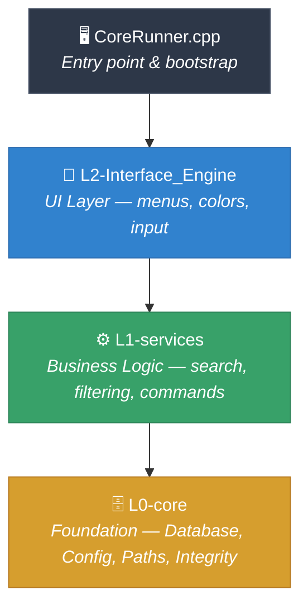

# Tguide


> **⚠️ This project is under active development and is not yet ready for production use. APIs, features, and database schema may change without notice.**

---

## What is Tguide?

Tguide is a terminal-based CLI reference tool built for penetration testers and security researchers. It provides an **offline**, **structured**, and **searchable** database of security tools, their flags, usage templates, and known vulnerabilities — all from a clean, color-coded terminal interface.

No internet required. No browser tabs. Everything you need — flags, protocols, templates, exploits — is one or two keystrokes away.

---

## 🛠️ Features

- 🗄️ **Offline-first** — bundled SQLite database, zero runtime internet dependency
- 🔍 **Search & filter** — find tools, flags, templates, and vulnerabilities instantly
- 🧩 **Template system** — fill placeholders, preview commands, and save them
- 🖥️ **Cross-platform** — Linux, macOS, Windows, and Termux/Android
- 🔒 **Legal compliance** — mandatory first-run disclaimer
- 💾 **Persistent user data** — saved commands and scripts across sessions
- 📤 **Export** — output to text, JSON, YAML, and CSV formats
- 🎨 **Color-coded UI** — ANSI terminal colors with runtime toggle
- 🛡️ **Database integrity** — SHA-256 hash verification and auto-recovery
- 📋 **CLI mode** — non-interactive flags for scripting and pipelines
- 🗃️ **Metasploit & recon-ng** — dedicated sub-menus for vulnerabilities and modules

---

## 🚀 Quick Start

### Prerequisites

| Dependency | Type | Notes |
|------------|------|-------|
| CMake 3.16+ | Build | `apt install cmake` / `brew install cmake` |
| GCC/Clang (C++17) | Build | `apt install g++` / `xcode-select --install` |
| libcurl | System | `apt install libcurl4-openssl-dev` |
| SQLite3 | System | `apt install libsqlite3-dev` / `pkg install sqlite` |
| nlohmann/json | Bundled | Header-only — no install needed |

### Build

```bash
git clone https://github.com/voidoxin/Tguide.git
cd Tguide
cmake -B build -DCMAKE_BUILD_TYPE=Release
cmake --build build
```

### Install (optional)

```bash
# Linux
sudo cmake --install build

# macOS / Termux / Windows
cmake --install build
```

### Run

```bash
./build/tguide
```

---

## 💻 CLI Usage

Tguide works both interactively and from the command line:

```bash
# Look up a specific tool
tguide --tool nmap

# List all vulnerabilities
tguide --vuln

# Browse tools by category
tguide --category "network"

# Filter results
tguide --tool nmap --filter flags
tguide --vuln --filter severity=critical

# Export saved scripts
tguide --saved-scripts --export-text output.txt
tguide --saved-scripts --export-json output.json
tguide --saved-scripts --export-csv output.csv

# Check for database updates
tguide --check-update
tguide --update

# View logs
tguide --log
tguide --log-b          # last boot
tguide --log-date 2026-06-09

# Manage settings
tguide --set colors=on
tguide --reset all
```

### Global Navigation (Interactive Mode)

| Input | Action |
|-------|--------|
| `0` / `back` | Previous screen |
| `q` / `quit` / `exit` | Clean exit |
| `next` / `n` | Next page |
| `prev` / `p` | Previous page |
| A number | Select item by index |

---

## 🏗️ Architecture

Tguide follows a strict **three-layer architecture** with unidirectional dependencies:



| Layer | Responsibility | Never... |
|-------|---------------|----------|
| **L0-core** | Database, config, paths, hashing, user data | Depends on L1 or L2 |
| **L1-services** | Search algorithms, template processing, command building | Depends on L2 |
| **L2-Interface_Engine** | Terminal I/O, menus, colors, navigation | Directly queries the database |

---

## 📂 Project Structure

```
tguide/
├── CoreRunner.cpp                    # Entry point & bootstrap
├── cli_display.cpp                   # CLI display commands (--tool, --vuln)
├── cli_export.cpp                    # Export to text/JSON/YAML/CSV
├── CMakeLists.txt                    # Build configuration
├── config/
│   └── config.json                   # Runtime configuration
├── data/
│   ├── database/tguide.db            # Official read-only SQLite database
│   └── signed_manifest.json          # DB version manifest
├── libs/
│   ├── json.hpp                      # Bundled nlohmann/json
│   └── doctest.h                     # Test framework
├── L0-core/                          # Foundation layer
│   ├── include/                      # DatabaseManager, PathResolver, etc.
│   └── src/                          # Implementations
├── L1-services/                      # Business logic layer
│   ├── includes/                     # Service interfaces & DTOs
│   └── src/                          # Implementations
├── L2-Interface_Engine/              # UI layer
│   ├── includes/                     # UI components
│   └── src/                          # Implementations
├── tests/                            # Unit tests (doctest)
├── tools/                            # Database builder scripts (Python)
└── tguide_docs/                      # Detailed documentation
```

---

## 📦 Dependencies

| # | Name | Type | Version | Purpose |
|---|------|------|---------|---------|
| 1 | SQLite3 | System | ≥ 3.0 | Embedded database engine |
| 2 | nlohmann/json | Bundled (header-only) | — | JSON parsing & serialization |
| 3 | libcurl | System | ≥ 7.0 | Database download fallback |
| 4 | doctest | Bundled (header-only) | 2.5.0 | Unit test framework (test-only) |
| 5 | C++ Standard Library | Compiler | C++17 | Core runtime |

> **No Boost, no OpenSSL, no threading libraries.** SHA-256 is a custom FIPS 180-4 implementation from scratch.

---

## 🧪 Testing

```bash
# Build with tests
cmake -B build -DCMAKE_BUILD_TYPE=Debug
cmake --build build

# Run all tests
ctest --test-dir build
```

Test coverage includes:
- SHA-256 hashing (known vectors, collision detection, streaming)
- ConfigManager (defaults, load/save, merge)
- UserDataManager (CRUD, persistence, edge cases)
- DB recovery (integrity check, backup restore)
- CLI parser (flags, arguments, edge cases)
- Path resolver (cross-platform paths)
- Search engine (indexing, fuzzy matching)
- Logger (boot tracking, date filtering)

---

## 🖥️ Platform Support

| Platform | Status | Notes |
|----------|--------|-------|
| Linux | ✅ Primary | Full support, all features |
| macOS | ✅ Supported | ANSI colors, user-space paths |
| Windows | ✅ Supported | MSVC compatible, no ANSI (plain output) |
| Termux/Android | ✅ Supported | ANSI colors, `$PREFIX` paths |

> Running tguide **never requires root** on any platform. All paths resolve to user-space.

---

## 🗺️ Roadmap

Tguide is **under construction**. Here's a high-level view of what's done and what's next:

**✅ Completed:**
- Phase 0 — Critical bug fixes & security hardening
- Phase 1 — Foundation layer (database, config, paths, integrity)
- Phase 2 — Core tools UI (browsing, search, templates, metasploit/recon-ng)
- Phase 3 — CLI flags, pagination, logging, export
- Database builder toolchain (Python)

**🚧 In Progress / Planned:**
- Saved commands & scripts UI screens
- Settings screen completion
- Enhanced search algorithm (inverted index + relevance scoring)
- Extension data system
- Cross-platform packaging (AUR, Homebrew, .deb, Windows)
- Package manager expansion (Snap, AppImage, WinGet, Scoop, Chocolatey)

See [ROADMAP.md](ROADMAP.md) for the full development plan.

---

## 🙏 Credits

> **Vibed by [Big Pickle](https://opencode.ai)** — AI-powered development assistant

**Author:** voidoxin

---

## 📄 License

This project is licensed under the [MIT License](LICENSE).

```
MIT License — Copyright (c) 2026 voidoxin
```
